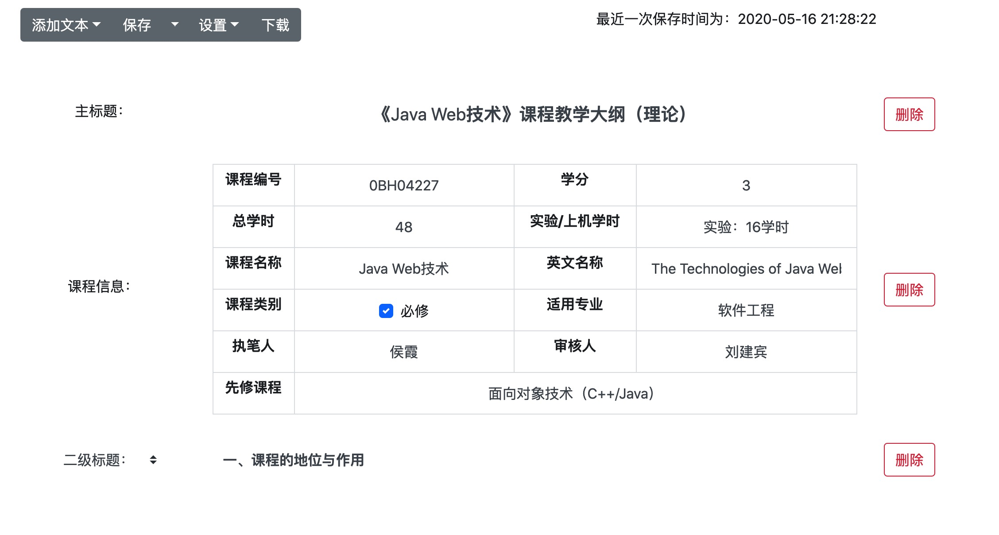
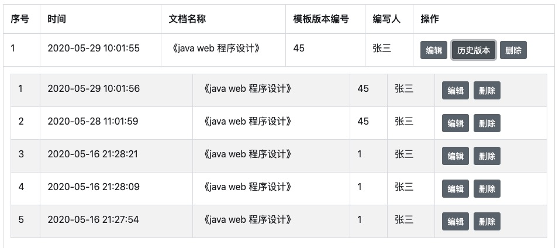
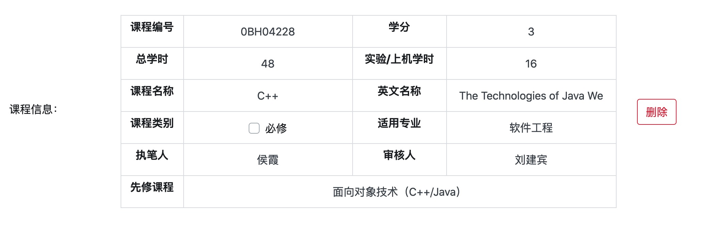
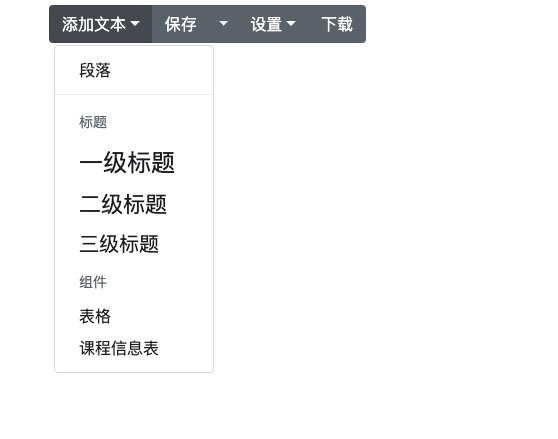

# outlineEditor-back-end
> 在此非常感谢sayi大佬的poi-tl项目，不论是我项目中使用到的还是向他源码学习模仿的部分，都让我在开发中受益匪浅，在此表达感谢。

课程大纲编辑管理系统（后端）
- [该项目的前端项目的地址](https://github.com/JKevin-5/outlineEditor-front-end)

## 开发环境
| apache.poi  | poi-tl  | springboot | mybatis|
| :----: | :----: | :----: | :----: |
| [v4.0.0](https://poi.apache.org/) | [v1.6.0](http://deepoove.com/poi-tl/) | [v2.2.5.RELEASE](https://spring.io/projects/spring-boot) | [v2.1.2](https://blog.mybatis.org/)

## 系统介绍
提供了一个可以随意编辑模板的网站，前期类比于电子调查问卷的方式。首先有一个可以任意编辑模板的功能，提供给模板的制作人员。他可以随意的编辑、保存、分发模板给其他的人员，其他的人员只能在大体框架内容不变的文件内进行有限的编辑，大大地减少了人传人的word模版文件分发形式带来的格式变化。内部还有审批流、历史版本、文档下载、课程表格组件、权限控制等功能，但是这些功能在现在看来实现的有局限性，希望能给这方面学习开发的小伙伴一点启发。

这是我的毕设作品，是当初老师给的一个命题，我看比较简单就拿过来做了。自己有私心想要做更好玩的东西，但是实力和时间摆在那儿。实际上的实现效果我也是相对而言比较满意的，没有拿到特别高的分数（80+），可能有一点是我的word文件格式并不很好看，且论文因为看多了学长的论文模版导致大家的论文和学长的论文重率还是蛮高的。

部分系统截图：
- 文档编辑画面

- 查看历史大纲

- 课程表格组件

- 模版编辑页面 

# 日志
## 2020.6.16
>这是毕设项目的后端部分，主要用到的技术为springboot、mybatis以及mysql，在word文档生成功能上使用的是Apache POI。
由于所实现的功能都比较基础，在后续有空的话会对ApachePOI的使用做一个简单的说明。

## 2021.11.15
>最近心血来潮，将自己过往做过的一些大大小小的项目进行一个小小的汇总，以后回头看也是一座座里程碑。
